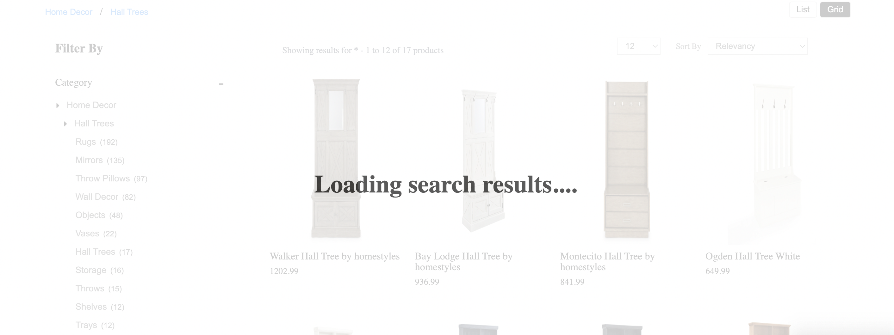

# Loader
{: .no_toc }

# Table of contents
{: .no_toc .text-delta }

1. TOC
{:toc}

---

# Definition
In e-commerce, a 'loader' is a visual element that is used to indicate to users that the website or application is currently loading or processing information. Loaders are commonly used in situations where a page is taking longer than expected to load or a process is taking longer than usual, such as when a user submits a form or initiates a search.

The loader is usually a simple animation, like a spinning wheel or a progress bar, that is displayed on the screen to let the user know that something is happening in the background. The loader will typically be displayed on the page until the process is complete, at which point it will be replaced with the relevant information or next page.

Loaders are useful in e-commerce websites as they can improve the user experience by providing users with visual feedback on the status of a task and help to reduce frustration if the load time is longer.

Additionally, loaders can be used to indicate to users that a server is currently processing their request, This can help to improve the trust on the website by making the users more aware of what is happening behind the scenes.

It is important to note that using loaders should be balanced with the performance of the website, as excessive use of loaders, or showing loaders for too long can negatively affect the user experience, making the website feel slow or unresponsive.

# Behavior

Configure page loader to be shown when fetching search API results by setting the “loader” config object. 

[](../assets/loader.png)

# Configurations

The following options are available under the object:  

## el
{: .d-inline-block }

Element
{: .label }

Required
{: .label .label-red}

"el" in loader is an HTML element that is designated to display loader component. This allows developers to control the placement of the loader on the webpage . The "el" can be set by providing the id or class of the element in the code.

### Default Value
{: .no_toc }

```js
el: null
```

### Scenarios
{: .no_toc }
There are several HTML selectors that can be used to locate the banner element in an e-commerce page. For ex: getElementById, getElementsByClassName, getElementsByTagName, querySelector, querySelectorAll, getElementsByName, etc.

---
## template
{: .d-inline-block }

Function
{: .label }
The "template" function here refers to the ability to change the look and feel of the loader component .

**Expected return value**: A string of HTML that will be used to render the loader component on the webpage.

### Default Value
{: .no_toc }
```js
function(){
    return '<div class="UNX-loader">Loading search results....</div>'
}
```	

### Scenarios
{: .no_toc }
For additional information on custom scenarios, please refer to the [use cases section](#usecases) located below.

# Default Example
Sample code for the Loader config:

```js
    {
        el: document.getElementById("loaderEl"),
        template: function(){
            return '<div class="UNX-loader">Loading....</div>'
        }
    }
```

# UseCases
## Usecase 1:
## Usecase 2:
## Usecase 3:
