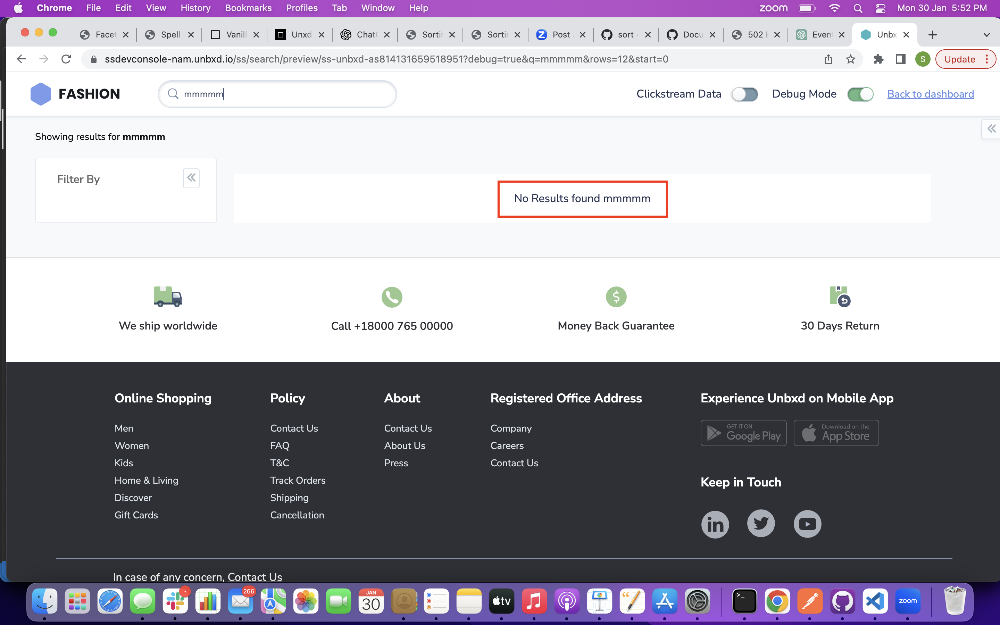

# No Results
{: .no_toc }

# Table of contents
{: .no_toc .text-delta }

1. TOC
{:toc}

---
# Definition

A "no results" or "zero results" page is a type of error page that is displayed when a customer conducts a search on an e-commerce website and no products are found that match the search criteria. This can happen when a customer enters a search term that is not in the website's product database or enters a misspelled search term.

This page usually contains a message indicating that no results were found and often include suggestions such as trying different search terms, modifying the filter settings, or exploring other parts of the website. Sometimes they also include related products or categories as well.

# Behavior

Configure the display to be rendered when there are no results by setting the “noResults” config object.

[](../assets/noresults.png)

# Configurations

The following options are available under the noResults object:  

```js
noResults:{
// the below noResults configurations goes here.
}
```

## template
{: .d-inline-block }

Function
{: .label }

Customize the look and feel of the no results component by using this function. You will get the searched query as param to this function.

This function takes single param:

1. `query` - the searched query , which generally refers to a request made by a user to search for specific products or information within the app.

### Default Value
{: .no_toc }
```js
template: function(query){
    return '<div class="UNX-no-results"> No Results found '+ query + '</div>'
}
```	
### Scenarios
{: .no_toc }
For additional information on custom scenarios, please refer to the [use cases section](#usecases) located below.

# UseCases
## Usecase 1

### User Requirement
{: .no_toc}

If the customer needs customized "no results" , the customized code can be added in `template` block of `noResults`.  
By default the noResults has default behaviour which can be overriden by adding you code here. One such integration is shown in below code snippet.


```js
noResults: {
        el: document.getElementById("noResultWrapper"),
        template: function (query) {
            document.getElementById("paginationContainer").style.display = "none";
            document.getElementById("header_message").style.display = "none";
            document.querySelector('.UNX-facet-wrapper').style.display = "none";
            document.querySelector('.UNX-mob-filters-mobile').style.display = "none"; 
            document.querySelector('.UNX-result-header').style.display = "none"; 
            return (
                `<div class="UNX-no-results">
                    <h1 class="h2 search-performed">
                        Search Results for:</h1>
                    <h2 class = "queryDisplay">
                    <span>
                        “'+query+'”
                    </span>
                    </h2>
                    <p role="status">
                        No results found for “'+query+'”. Check the spelling or use a different word or phrase.
                    </p>
                <div>`
                )
        }
}

```
