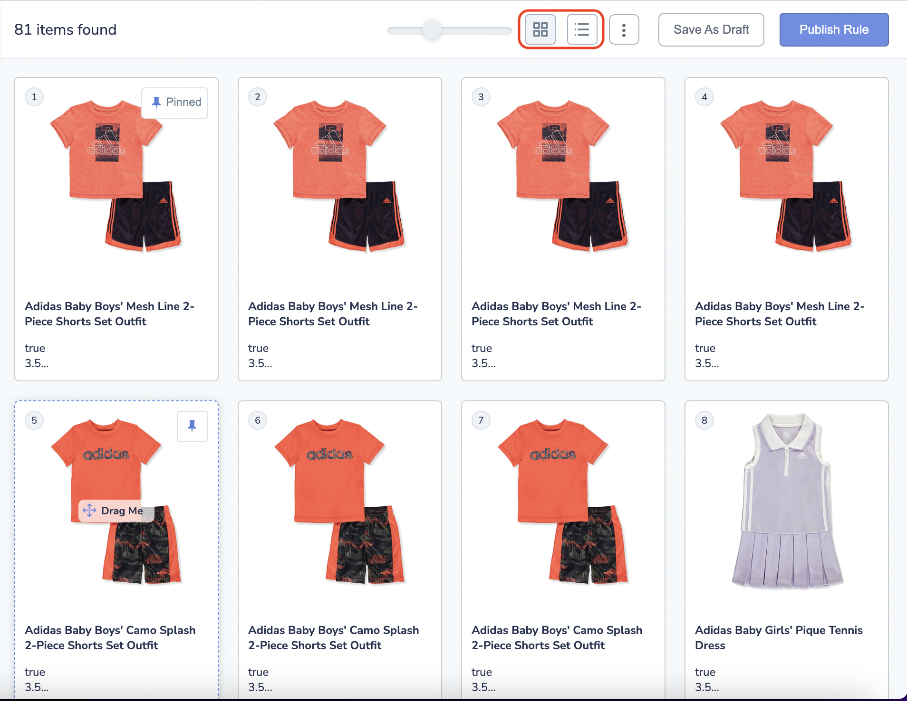
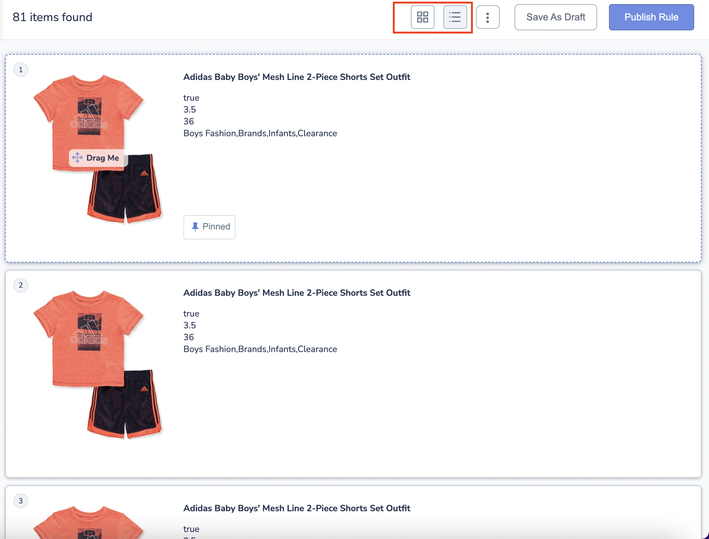

# Product View
{: .no_toc }

# Table of contents
{: .no_toc .text-delta }

1. TOC
{:toc}

---

# Definition

In an e-commerce page, the list view and grid view are two different ways of displaying products to users.

List view typically displays products in a vertical, scrolling list format, with each product represented by an individual item. Each item in the list typically includes a product image, name, price, and a brief description. The items are usually aligned vertically and take up the entire width of the screen, which allows for a lot of information to be visible at once, and can be helpful for users that want to compare multiple products quickly.

Grid view, on the other hand, displays products in a grid format with multiple products displayed in rows and columns. Each product is represented by a thumbnail image and can include the name, price, and a brief description. Grid view allows for a more compact display of products and is useful for situations where there are many products to be displayed on a single page. It's usually preferred when the user wants to get an overview of the products quickly.

Both the grid and list view have their own advantages and disadvantages, and it depends on the e-commerce website which view is used as default or an option for the users to switch between them. Some websites use grid view as the default, while others use list view. Some websites provide an option for the users to switch between views so they can choose which format they prefer.

# Behavior

You can configure the way in which the products have to be displayed (List or Grid) with the Product Views widget.

[](https://unbxd.com/docs/wp-content/uploads/2020/05/page-view-new.png)

# Configurations

Update the options under the “productView” config object to configure the product view feature.

```js
productView:{
// the below productView configurations goes here.
}
```

## enabled
{: .d-inline-block }

Boolean
{: .label }

"Enabled" is a flag or switch that allows developers to turn on or off a specific feature in an e-commerce website. In this context, the "Product view feature" refers to the ability to display  Product view.

When the "enabled" flag is turned ON, the productview feature will be active and productview will be displayed on the website. This can be used to promote new products, sales, or other special offers. When the "enabled" flag is turned OFF, the productview feature will be disabled and no productview will display.

### Default Value
{: .no_toc }

```js
enabled: true
```

### Scenarios
{: .no_toc }
1. `true` -  productview will be displayed on the website 
2. `false` - the productview feature will be disabled

---

## el
{: .d-inline-block }

Element
{: .label  }

Required
{: .label  .label-red}

"el" in productview is an HTML element that is designated to display productview. This allows developers to control the placement of the productview on the webpage and to ensure that they are displayed in a prominent and visible location. The "el" can be set by providing the id or class of the element in the code.

### Default Value
{: .no_toc }

```js
el: null
```

### Scenarios
{: .no_toc }
There are several HTML selectors that can be used to locate the productview element in an e-commerce page. For ex: getElementById, getElementsByClassName, getElementsByTagName, querySelector, querySelectorAll, getElementsByName, etc.

---
## template
{: .d-inline-block }

Function
{: .label }

The "template" function here refers to the ability to change the appearance of the productview feature on the e-commerce website. It allows developers to control the appearance of the productview by providing custom HTML. The function receives the list of productview to be displayed, and the productview configurations as parameters and it needs to return a string of HTML that will be used to render the productview on the webpage.

This function accepts two params:
1. `selectedViewType` - Its value might either be "GRID" or "LIST."
2. `productViewType` - it is productview object that contains information like the selectedViewTypeClass and viewTypeClass.

**Expected return value**: a string of HTML that will be used to render the productview on the webpage


### Default Value
{: .no_toc }

```js
template:function(selectedViewType, productViewType) {
    const isDisabled = (this.getSearchResults())?false:true;
    const {
        selectedViewTypeClass,
        viewTypeClass
    } = productViewType;
    const {
        UNX_gridBtn,
        UNX_listBtn
    } = this.testIds;
    let listBtnCss =`UNX-list-btn ${viewTypeClass}`;
    let gridBtnCss = `UNX-grid-btn ${viewTypeClass}`;
    const gTAttr = `data-test-id=${UNX_gridBtn}`;
    const lTAttr = `data-test-id=${UNX_listBtn}`;
    if(selectedViewType === 'LIST' ) {
        listBtnCss += ` ${selectedViewTypeClass}`
    }
    if(selectedViewType === 'GRID' ) {
        gridBtnCss += ` ${selectedViewTypeClass}`
    }
    let listBtn = `<button id="listBtn" class="${listBtnCss}" ${lTAttr} data-view-action="LIST" >List</button>`;
    let gridBtn = `<button ${gTAttr} id="gridBtn" class="${gridBtnCss}" data-view-action="GRID" >Grid</button>`;
    if(isDisabled) {
        listBtn = `<button ${lTAttr} id="listBtn" disabled class="${listBtnCss} disabled-btn" data-view-action="LIST" >List</button>`;
        gridBtn = `<button ${gTAttr} id="gridBtn" disabled class="${gridBtnCss}  disabled-btn"data-view-action="GRID" >Grid</button>`;
    }
    return `${listBtn} ${gridBtn}`

}
```

### Scenarios
{: .no_toc }

For additional information on custom scenarios, please refer to the [use cases section](#usecases) located below.

---
## defaultViewType
{: .d-inline-block }

String
{: .label }

Product view types to be displayed by default.

### Default Value
{: .no_toc }
```js
defaultViewType:"GRID"
```

### Scenarios
{: .no_toc }

1. "GRID" : Product view will be like grid.
2. "LIST" : Product view will be  like list.

---
## action
{: .d-inline-block }

String
{: .label }

Action on which product view change should be triggerd: “click” or “change”

### Default Value
{: .no_toc }

```js
action:"click"
```

### Scenarios
{: .no_toc }
1. `Click`: Click refers to a user interaction where a user clicks on a specific button or interface element to initiate a productview operation.
2. `Change`: Change refers to a productview operation that is initiated when a specific variable or data element is changed

---
## viewTypeClass
{: .d-inline-block }

String
{: .label }

Additonal CSS class name to be added to the product view type elements

### Default Value
{: .no_toc }
```js
viewTypeClass:"UNX-product-view"
```

### Scenarios
{: .no_toc }

Any valid class name can passed here.

---
## selectedViewTypeClass
{: .d-inline-block }

String
{: .label }

Additional CSS class name to be added to the selected view type element

### Default Value
{: .no_toc }
```js
selectedViewTypeClass:"UNX-selected-product-view"
```
### Scenarios
{: .no_toc }

Any valid class name can passed here.

---
## tagName
{: .d-inline-block }

String
{: .label }

"tagName" refers to the name of an HTML tag used to wrap or structure the content on a webpage.

### Default Value
{: .no_toc }

```js
tagName: 'div'
```

### Scenarios
{: .no_toc }
Any valid html tag such as div, span, p, h1, h2, etc in which you like the code to be wrapped in.

---
## htmlAttributes
{: .d-inline-block }

Object
{: .label }

"htmlAttributes" refers to a set of key-value pairs that provide additional information or properties for an HTML element. By default it contains classes for the wrapper. You can add more classes or any valid attributes.

### Default Value
{: .no_toc }
```js
htmlAttributes:{class:"product-view-container"}
```

### Scenarios
{: .no_toc }
Any valid html attribute can be passed as `key : value` pairs inside an object.

---

# Data-actions

## data-view-action
Actions mentioned below needs to be added as `data-view-action`.

1. `LIST` - Action is needed on the list button / element , clicking on which would change to list view. 
2. `GRID` - Action is needed on the grid button / element , clicking on which would change to grid view.

---
# UseCases
## Usecase 1 : Grid view
1. When viewType is equal to GRID.

[](../assets/GRID.png)

configuration:
```js
productView : {
       enabled:true,
       el: document.getElementById("productViewTypeContainer"),
       action: “click”, // CLICK or CHANGE
       viewTypeClass: “UNX-product-view”,
       selectedViewTypeClass: “UNX-selected-product-view”,
       viewTypes: “GRID”,
       template:function(selectedViewType, productViewType) {
        const isDisabled = (this.getSearchResults())?false:true;
        const {
            selectedViewTypeClass,
            viewTypeClass
        } = productViewType;
        const {
            UNX_gridBtn,
            UNX_listBtn
        } = this.testIds;
        let listBtnCss =`UNX-list-btn ${viewTypeClass}`;
        let gridBtnCss = `UNX-grid-btn ${viewTypeClass}`;
        const gTAttr = `data-test-id=${UNX_gridBtn}`;
        const lTAttr = `data-test-id=${UNX_listBtn}`;
        if(selectedViewType === 'LIST' ) {
            listBtnCss += ` ${selectedViewTypeClass}`
        }
        if(selectedViewType === 'GRID' ) {
            gridBtnCss += ` ${selectedViewTypeClass}`
        }
        let listBtn = `<button id="listBtn" class="${listBtnCss}" ${lTAttr} data-view-action="LIST" >List</button>`;
        let gridBtn = `<button ${gTAttr} id="gridBtn" class="${gridBtnCss}" data-view-action="GRID" >Grid</button>`;
        if(isDisabled) {
            listBtn = `<button ${lTAttr} id="listBtn" disabled class="${listBtnCss} disabled-btn" data-view-action="LIST" >List</button>`;
            gridBtn = `<button ${gTAttr} id="gridBtn" disabled class="${gridBtnCss}  disabled-btn"data-view-action="GRID" >Grid</button>`;
        }
        return `<div class='product-view-container'>${listBtn} ${gridBtn} </div>`

    },
   }
```

## Usecase 2: List view
1. LIST: when viewTypes is equal to LIST.

[](../assets/LIST.png)

configuration:
```js

productView:{
    // ...other confiurations goes here
     viewTypes: “LIST”,
}
```

# FAQs

1. [What is list view and grid view in product listing page?](../Faqs#what-is-list-view-and-grid-view-in-product-listing-page)