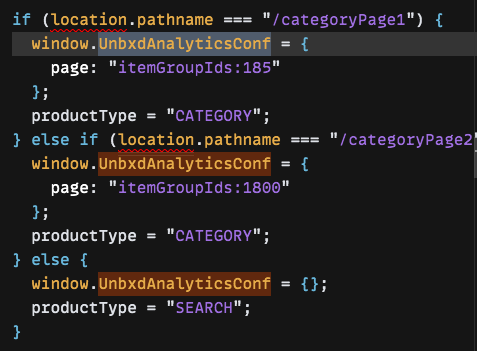

# Table of contents
{: .no_toc .text-delta }

1. TOC
{:toc}

# Setup in local
The below steps will help you set up a simple ecommerce website with search & category pages in your local machine. The latest unbxd search sdk is integrated with the same. 
The demo data is of fashion vertical.

1. Hit [demo playground url](https://codesandbox.io/s/vanilla-sandbox-demo-ezmi0v) in browser.
2. Click on Export to ZIP option.

    [](ZIP from codesandbox)
3. Unzip the folder
4.  Customize the config inside **src/js/index.js** as per the feed (optional)
    1. Change **siteKey** and **apiKey**.
    ```js
    siteKey: "<<site key>>",
    apiKey: "<<api key>>"
    ```
    2. Modify **attributesMap** inside **products** object.
        ```js
        attributesMap: {
        "unxTitle": "<<title attribute>>",
        "unxImageUrl": "<<image url attribute>>",
        "unxPrice": "<<price attribute>>",
        "unxDescription":"<<description attribute>>"
        };
        ```
    3. Provide **product attributes** to be returned from the search api:
        ```js
        productAttributes: ["<<title attribute>>","<<image url attribute>>","<<price attribute>>","<<description attribute>>"]
        ```
    4. Configure the correct category ids for the **UnbxdAnalyticsConf** window object in the   following places:<br/>

        [](UnbxdAnalyticsConf variable configuration)
        
        [](UnbxdAnalyticsConf variable configuration)<br/>

5. Run the following commands in terminal inside the unzipped folder:<br/>
Install required version of node using nvm:<br/>
```nvm install v14.15.0```<br/>
Use that version of node:<br/>
```nvm use v14.15.0```<br/>
Install dependencies:<br/>
```npm install```<br/>
Run the webpack server:<br/>
```npm run start```<br/>

{: .info }
> Additional links for above tools:<br/>
[Download Node](3https://nodejs.org/en/download/)<br/>
[Setup nvm](https://nodesource.com/blog/installing-node-js-tutorial-using-nvm-on-mac-os-x-and-ubuntu/)<br/>


